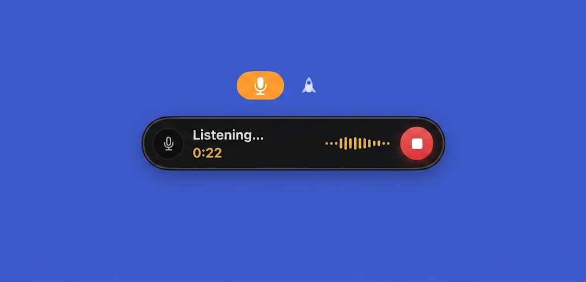

# WhisperRocket Remote for Mac

**Dictate from your Mac through your WhisperRocket host — silent, fast, private.**

🌐 **[whisperrocket.app](https://whisperrocket.app/)**

<p align="center">
  
</p>

WhisperRocket Remote is a thin macOS menu bar client for [WhisperRocket](https://github.com/gaborkis11/WhisperRocket), the local speech-to-text desktop application. The Mac does **no speech recognition of its own**: it records your voice, sends the audio to the WhisperRocket host on your own machine over [Tailscale](https://tailscale.com), and puts the finished text on your clipboard a few seconds later — with the same model, the same personal dictionary and the same AI cleanup you use at the desk. Nothing ever leaves your own machines.

## How it works

1. Press the global hotkey (default **⇧⌘Space**) anywhere — a small capsule HUD appears under the menu bar icon with a live equalizer that dances to your voice.
2. Speak. Press the hotkey again (or click the red stop button) to stop and send. Press **Esc** instead to cancel — nothing is sent.
3. The rocket flies while the host transcribes; the text lands on your clipboard, ready to paste — or is typed straight at your cursor if auto-typing is enabled.

## Features

- **Global hotkey toggle** — one shortcut starts and stops the recording, configurable in Settings
- **Capsule HUD** — a compact, always-dark pill with live audio levels, countdown, and clear success/failure states
- **Esc to cancel** — active only while recording; the recording is kept but nothing is sent
- **Never lose a recording** — audio is written to disk from the first sample; failed sends retry automatically, and the last recording can always be re-sent from the menu
- **Auto-typing with a focus guard** — the text is pasted at your cursor only if you are still in the app you dictated into; otherwise it stays safely on the clipboard
- **Pre-flight host check** — if the host is unreachable, you are warned *before* you start talking
- **Private by design** — audio travels only inside your own Tailscale network; the access token lives in the macOS Keychain and is never shown again
- **Native menu** — last recording status, re-send, Settings, About, all from the menu bar icon

## Requirements

- macOS 15 or newer, Apple Silicon (M1 and up)
- A running [WhisperRocket](https://github.com/gaborkis11/WhisperRocket) host with the phone/remote dictation endpoint enabled
- [Tailscale](https://tailscale.com) on both machines, signed in to the same account

## Install

Download the DMG from the [latest release](https://github.com/gaborkis11/whisperrocketremoteformac/releases/latest), open it and drag **WhisperRocket Remote** to Applications.

- **First launch**: right-click the app and choose **Open** — the build is signed with a development certificate but not notarized, so Gatekeeper asks once.
- Grant **microphone** access when prompted; enabling auto-typing in Settings prompts for **Accessibility**.
- In **Settings**, enter the host address (your WhisperRocket machine's Tailscale IP and port, default `8771`) and the access key shown on the host's Phone tab.

Releases are versioned by date (`2026-09-05`); a same-day follow-up gets a `.1` suffix.

## Build from source

No Xcode project — the app builds with the Swift Package Manager and a small assembly script:

```bash
./scripts/build-app.sh   # swift build + .app bundle + codesign
./scripts/install.sh     # installs to /Applications
```

Run `swift test` for the unit suite. The app ships with a set of self-verification probes (`--capsule-probe`, `--l10n-probe`, `--escape-probe`, …) that render and check the UI offscreen.

## Related

- **[whisperrocket.app](https://whisperrocket.app/)** — the official website
- **[WhisperRocket](https://github.com/gaborkis11/WhisperRocket)** — the desktop application this client talks to: real-time local transcription with Whisper, GPU acceleration, AI cleanup, file transcription and more. Currently Linux-first.

## Roadmap

- The full WhisperRocket desktop application is planned to become available on macOS as well — this remote client is the first step of the Mac story.
- In-app update checking, once releases are published.

---

Powered by **Studio137** · Developed by **Gabor Kis**

© 2026 Gabor Kis. All rights reserved.
